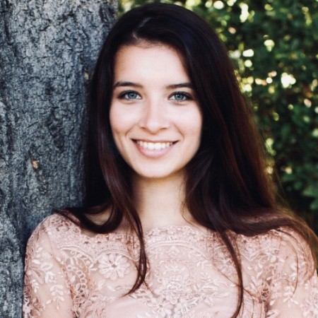

# Welcome

I'm currently a 4th year PhD candidate in Psychology at UC Berkeley, advised by Mahesh Srinivasan in the Language and Cognitive Development Lab. My main interests are language acquisition, specifically word learning in early development, and the construction of meaning across time. 

 [Click here for my CV](nschoener.github.io/NS_CV_06-11-2026.pdf) 

